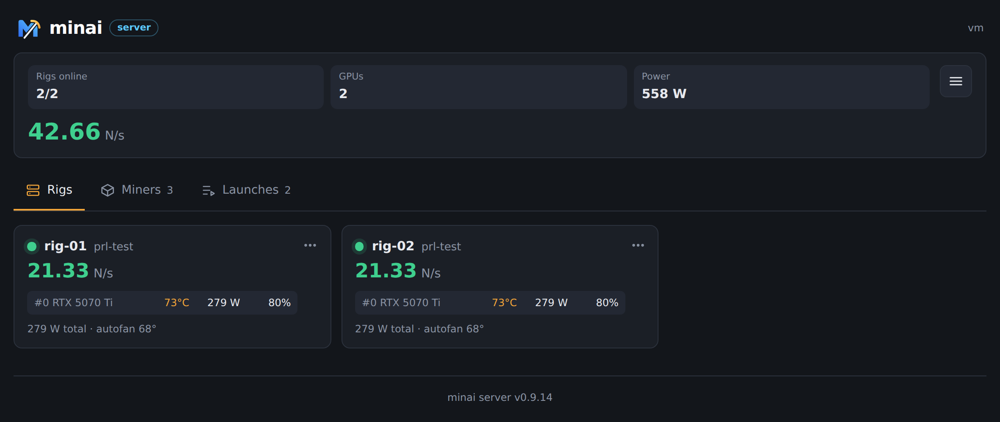
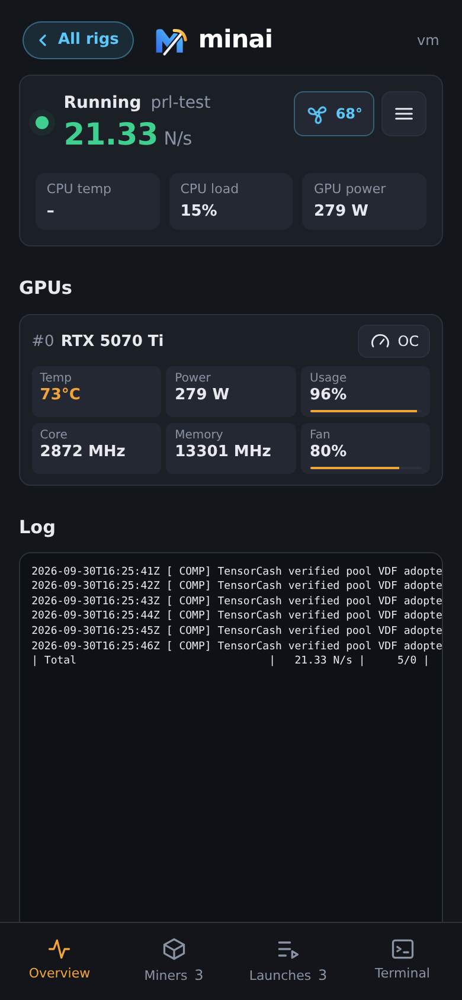
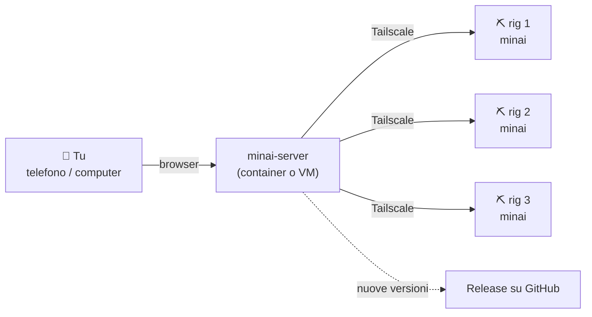
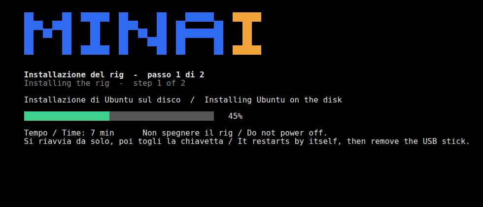
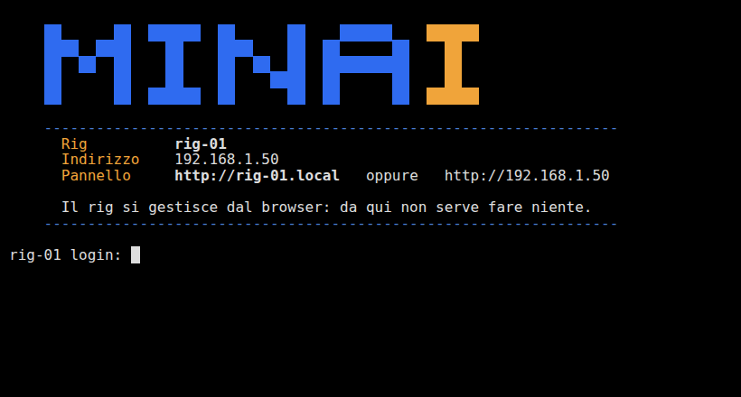

<p align="center">
  
</p>

<h1 align="center">minai</h1>

<p align="center">
  <b>Pannello self-hosted per gestire i rig di mining GPU.</b><br>
  Controlla, configura e aggiorna tutti i tuoi rig da una sola pagina, dal telefono o dal computer.<br>
  Senza abbonamento, senza account cloud, senza costi per rig.
</p>

<p align="center">
  <a href="https://github.com/ilgio/minai/releases/latest"></a>
  
  
</p>

<p align="center"><a href="README.md">🇬🇧 Read in English</a></p>

<p align="center">
  
</p>

---

## Cosa fa

minai è fatto di due parti:

- **minai** gira su ogni rig: miner, lanci, overclock, autofan, log in tempo reale, terminale.
- **minai-server** è la dashboard centrale: vede tutti i rig e tiene un catalogo condiviso di miner e lanci.

| | |
|---|---|
| 📊 **Dashboard in tempo reale** | Hashrate, temperatura GPU, consumo, ventole e CPU di ogni rig, più i totali della farm. |
| 🚀 **Lanci condivisi** | Scrivi un lancio una volta e avvialo su qualsiasi rig. Il miner viene scaricato e installato da solo. `%WORKER_NAME%` diventa il nome del rig. |
| 🎛️ **Overclock e autofan** | Offset di core e memoria, clock bloccati, power limit. Autofan come HiveOS, con temperatura obiettivo e critica. |
| 💻 **Terminale vero** | Un terminale completo nel browser (htop, nano, sudo…), con la sessione che resta aperta sul rig. |
| 🔄 **Aggiornamenti con un tocco** | minai controlla su GitHub le nuove versioni di sé stesso e dei tuoi miner, e li aggiorna dal pannello. Il mining non si ferma. |
| 💿 **Chiavetta di installazione** | Inserisci la chiavetta in un rig con l'SSD vuoto e accendilo: non servono monitor né tastiera. |
| 🔒 **Privato per scelta** | Niente è esposto su internet: rig e server comunicano con [Tailscale](https://tailscale.com). |
| 📱 **Comodo sul telefono** | Tema scuro, tab in basso su iPhone, si aggiunge alla schermata Home come un'app. |
| 🌍 **Italiano e inglese** | La lingua si cambia dalle Impostazioni. |

<p align="center">
  
</p>

## Come funziona



I rig possono stare ovunque (ufficio, casa, un garage): Tailscale li collega senza aprire porte sui router.

## Cosa serve

- **Rig:** PC x86-64 con GPU NVIDIA, cavo di rete, un SSD su cui installare (viene **cancellato**).
- **Server:** una piccola macchina, container o VM Debian/Ubuntu (1 CPU, 512 MB di RAM, 4 GB di disco). Non serve un IP pubblico.
- **Un account [Tailscale](https://tailscale.com) gratuito**, usato solo da minai. Consigliamo un account dedicato, separato da quello personale o di lavoro.

## Installazione veloce

### 1. Installa minai-server

Su una macchina, container o VM Debian/Ubuntu, come root:

```bash
apt install -y curl
curl -fsSL https://github.com/ilgio/minai/releases/latest/download/get-server.sh | bash
```

Compare un QR code: inquadralo con il telefono e accedi a Tailscale. Un secondo QR può chiederti di autorizzare una volta l'**indirizzo sicuro** (HTTPS): tocca **Abilita**. Poi apri l'indirizzo che compare alla fine, per esempio `https://minai-server.tailXXXX.ts.net`, da un dispositivo collegato allo stesso account Tailscale, e scegli la password del pannello.

> **Container Proxmox (LXC):** usa un container unprivileged con *nesting* attivo, e passagli `/dev/net/tun` (*Resources → Add → Device Passthrough*). Se manca, l'installer te lo dice.

### 2. Installa i rig

**Con la chiavetta (consigliato)**

1. Scarica **[minai-installer.iso](https://archive.org/download/minai-installer/minai-installer.iso)** (3,4 GB, ospitata su Internet Archive).
2. Facoltativo: controlla che il download sia integro. Il risultato deve coincidere con:

   | | |
   |---|---|
   | SHA-256 | `1ffd0a88b23b5eaeb0839b03a896d9dfe99c236d0b65c34aaba2fe41c5fb3042` |
   | MD5 | `5f32ce8e413fd5f5053c6d96cb3b1951` |

   Mac/Linux: `shasum -a 256 minai-installer.iso` · Windows: `certutil -hashfile minai-installer.iso SHA256`
3. Scrivila su una chiavetta (da 8 GB in su) con [balenaEtcher](https://etcher.balena.io).
4. Inseriscila nel rig (con il cavo di rete collegato) e accendilo. Dopo 10 secondi l'installazione parte da sola, poi il rig configura driver NVIDIA, minai e Tailscale. Ci vogliono circa 30-40 minuti e due riavvii. Non servono monitor né tastiera.

<p align="center"></p>

> ⚠️ **La chiavetta cancella il disco più grande di qualsiasi PC che si avvia da lì** (a meno che non ci sia già minai). Etichettala e tienila al sicuro.

**Su un Ubuntu Server 24.04 già installato**, con il driver NVIDIA già presente (come utente normale, non root):

```bash
curl -fsSLO https://github.com/ilgio/minai/releases/latest/download/minai.zip
unzip minai.zip && bash minai/install.sh
```

### 3. Collega il rig

1. Dal telefono o dal computer, nella stessa rete, apri **`http://minai-setup.local`** (oppure l'indirizzo IP che compare sullo schermo del rig).
2. Scegli il **nome del rig** e la sua **password**.
3. Si aprono da sole le Impostazioni: **collega Tailscale** con lo stesso account del server (facoltativo, vedi sotto).
4. In minai-server: **menu → Aggiungi rig**, e incolla indirizzo e token che trovi nelle Impostazioni del rig.

> **Un solo rig, o niente server?** Tailscale è facoltativo. Chiudi la finestra con **Salta per ora** e il rig funziona da solo: lo gestisci da `http://nome-del-rig.local` o dal suo indirizzo IP in rete locale, con tutte le funzioni (miner, lanci, overclock, autofan, terminale, aggiornamenti). Puoi collegarlo a Tailscale e a minai-server anche più tardi, dalle Impostazioni.

### 4. Inizia a minare

- Tab **Miner**: aggiungi un miner con il link alla sua release (`.tar.gz`, `.zip` o binario). Gli aggiornamenti delle release GitHub vengono controllati da soli.
- Tab **Lanci**: scrivi il comando completo (pool, wallet, opzioni), con `%WORKER_NAME%` al posto del nome del rig, per esempio:
  ```bash
  #!/bin/bash
  cd /home/user/miners/srbminer
  exec ./SRBMiner-MULTI --algorithm pearlhash --pool stratum+tcp://pool:3333 --wallet WALLET.%WORKER_NAME%
  ```
- **GPU per rig:** ogni scheda GPU nel pannello del rig ha l'interruttore **Attiva/Disattivata**. La maggior parte dei miner semplicemente non vede le GPU disattivate. Per i miner che vogliono l'elenco delle GPU, scrivi `%GPU_ENABLED%` nel lancio: diventa l'elenco delle GPU attive del rig, per esempio `0,1`. Nei lanci condivisi non scrivere numeri di GPU fissi.
- **Avvia su…**: scegli i rig.
- **Sempre allineati:** ogni modifica al catalogo (miner e lanci nuovi, aggiornati, rinominati o eliminati) arriva da sola su tutti i rig. Rinominando un miner, cartella e dati restano.
- **Lanci di prova:** nel pannello del rig, **Modifica lancio** apre l'editor proprio sopra il log in tempo reale. **Prova** fa girare la tua versione solo su quel rig, temporaneamente. Quando chiudi scegli **Salva sul server**, **Salva come nuovo lancio** o **Scarta**. Una prova dimenticata torna da sola al lancio del catalogo dopo 10 minuti. Se manca il miner viene installato, poi il lancio parte.

Hai già un rig con miner e lanci? Apri le sue impostazioni (⋯) in minai-server e scegli **Importa miner e lanci da questo rig**.

## Aggiornamenti

Quando esce una nuova versione, accanto al logo compare il badge arancione **vX.Y disponibile**. Toccalo per aggiornare minai-server; i rig mostrano il pulsante **aggiorna** sulla loro scheda, oppure li aggiorni tutti insieme. Il mining non si ferma durante gli aggiornamenti.

<p align="center"></p>

## Buono a sapersi

- **Scadenza di Tailscale:** di default Tailscale chiede ai dispositivi di rifare l'accesso ogni 180 giorni. minai-server ti avvisa e ti mostra, con un'immagine, come disattivarla una volta per dispositivo.
- **`minai-setup.local` non si apre?** I nomi `.local` funzionano solo dentro la stessa rete. Se telefono e rig sono su reti/VLAN diverse, usa l'indirizzo IP che compare sullo schermo del rig, oppure attiva l'mDNS nel router.
- **I miner girano come utente normale, non come root:** un miner difettoso o malevolo non può toccare il sistema. I lanci non devono scrivere in cartelle di sistema come `/opt`, `/root` o `/var`: usa la cartella del miner o `~/models`.
- **Il miner fermato resta fermo:** se fermi il miner dal pannello, non riparte dopo un riavvio finché non avvii un lancio.
- **Registri:** primo avvio `/var/log/minai-firstboot.log`, aggiornamenti del rig `/opt/miners/update.log`.

## Sicurezza

- minai-server e i rig non sono mai esposti su internet: si raggiungono solo attraverso la tua rete Tailscale.
- Ogni rig ha il suo token, che revochi togliendo il rig dal server.
- I pannelli sono protetti da password, con una sessione di 30 giorni.
- Gli aggiornamenti si installano dalle release di questo repository, e solo quando tocchi il badge. Proteggi il tuo account GitHub con l'autenticazione a due fattori.
- La console dei rig installati con la chiavetta ha utente `user` e password `minai`: cambiala con `passwd` se il rig è accessibile fisicamente ad altri.

## Struttura del repository

| Cartella | Contenuto |
|---|---|
| `minai/` | Pannello del rig e servizi (miner, overclock, autofan, terminale). |
| `minai-server/` | Dashboard centrale. |
| `minai-installer/` | Sorgenti della chiavetta di installazione (vedi [BUILD.md](minai-installer/BUILD.md) per creare la ISO). |
| `docs/` | Immagini di questo README. |

Ogni release contiene `minai.zip`, `minai-server.zip` e `get-server.sh`, creati da queste cartelle. La ISO della chiavetta è su [Internet Archive](https://archive.org/download/minai-installer/minai-installer.iso), perché supera il limite di 2 GB per file di GitHub.

## Avvertenze

minai è un progetto indipendente, non collegato a HiveOS, NVIDIA o Tailscale. Overclock e mining possono danneggiare l'hardware se configurati male: lo usi a tuo rischio.

## Sostieni minai

minai è gratuito e open source. Se ti è utile, puoi sostenerne lo sviluppo con una donazione in crypto. Grazie! ♥

| Moneta | Rete | Indirizzo |
|---|---|---|
| **BTC** | Bitcoin | `bc1qwu78fsvm0xsg5s9pmclktetaxzc8fnea0vxy08` |
| **ETH** | Ethereum | `0x7192010b5a6A29844530b01078A11277e3Fc40AF` |
| **USDT** | Ethereum (ERC-20) o BNB Smart Chain (BEP-20) | `0x7192010b5a6A29844530b01078A11277e3Fc40AF` |
| **BNB** | BNB Smart Chain (BEP-20) | `0x7192010b5a6A29844530b01078A11277e3Fc40AF` |
| **SOL** | Solana | `8EnZmovmtahHDPwg3FGTvUabgixCAFeLbnYtmzjty1r7` |

Invia solo sulla rete indicata: i fondi inviati su una rete diversa possono andare persi. Gli stessi indirizzi, con i QR code, sono nel pannello alla voce **♥ Dona**.

## Licenza

minai è distribuito con licenza [GNU AGPL-3.0](LICENSE): puoi usarlo, modificarlo e condividerlo liberamente, ma le versioni modificate, anche quelle offerte come servizio online, devono restare open source con la stessa licenza e mantenere la citazione dell'autore originale.
