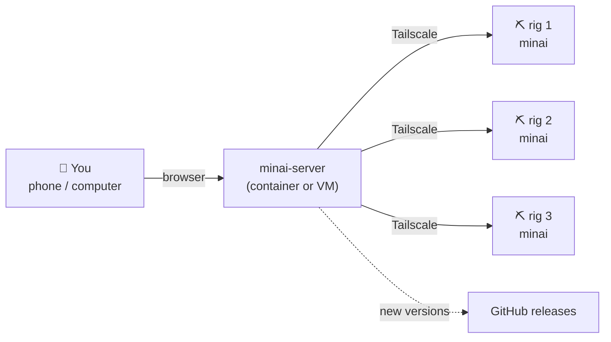

<p align="center">
  
</p>

<h1 align="center">minai</h1>

<p align="center">
  <b>A self-hosted control panel for GPU mining rigs.</b><br>
  Monitor, configure and update all your rigs from one page, on your phone or your computer.<br>
  No subscription, no cloud account, no per-rig fee.
</p>

<p align="center">
  <a href="https://github.com/ilgio/minai/releases/latest"></a>
  
  
</p>

<p align="center"><a href="README.it.md">🇮🇹 Leggi in italiano</a></p>

<p align="center">
  
</p>

---

## What it does

minai is made of two parts:

- **minai** runs on each rig: miner, launches, overclock, autofan, live log, terminal.
- **minai-server** is the central dashboard: it sees all your rigs and keeps a shared catalog of miners and launches.

| | |
|---|---|
| 📊 **Live dashboard** | Hashrate, GPU temperature, power, fan and CPU for every rig, plus farm totals. |
| 🚀 **Shared launches** | Write a launch once, start it on any rig. The miner is downloaded and installed automatically. `%WORKER_NAME%` becomes the rig name. |
| 🎛️ **Overclock and autofan** | Core/memory offsets, locked clocks, power limit. HiveOS-style autofan with target and critical temperature. |
| 💻 **Real terminal** | A full terminal in the browser (htop, nano, sudo…), session kept alive on the rig. |
| 🔄 **One-click updates** | minai checks GitHub for new versions of itself and of your miners, and updates them from the panel. Mining never stops. |
| 💿 **USB installer** | Plug the stick into a rig with a blank SSD and switch it on: no monitor or keyboard needed. |
| 🔒 **Private by design** | Nothing is exposed to the internet: rigs and server talk over [Tailscale](https://tailscale.com). |
| 📱 **Phone friendly** | Dark theme, bottom tabs on iPhone, add it to your home screen like an app. |
| 🌍 **Italian and English** | Switch language in Settings. |

<p align="center">
  
</p>

## How it works



Rigs can be anywhere (office, home, a garage): Tailscale connects them without opening any port on your routers.

## Requirements

- **Rigs:** x86-64 PC with an NVIDIA GPU, network cable, an SSD to install on (it gets **wiped**).
- **Server:** any small Debian/Ubuntu machine, container or VM (1 CPU, 512 MB RAM, 4 GB disk). It doesn't need a public IP.
- **A free [Tailscale](https://tailscale.com) account**, used only by minai. We recommend a dedicated account, separate from your personal or work one.

## Quick start

### 1. Install minai-server

On a Debian/Ubuntu machine, container or VM, as root:

```bash
apt install -y curl
curl -fsSL https://github.com/ilgio/minai/releases/latest/download/get-server.sh | bash
```

A QR code appears: scan it with your phone and log in to Tailscale. Then open the address printed at the end, for example `http://100.x.x.x:8090`, from a device connected to the same Tailscale account, and choose the panel password.

> **Proxmox LXC:** use an unprivileged container with *nesting* enabled, and give it `/dev/net/tun` (*Resources → Add → Device Passthrough*). The installer tells you if it's missing.

### 2. Install the rigs

**With the USB installer (recommended)**

1. Download **`minai-installer.iso`**: the link is in the notes of the [latest release](https://github.com/ilgio/minai/releases/latest).
2. Write it to a USB stick (8 GB or more) with [balenaEtcher](https://etcher.balena.io).
3. Plug it into the rig (network cable connected) and switch it on. After 10 seconds the installation starts by itself, then the rig configures NVIDIA drivers, minai and Tailscale. It takes about 30–40 minutes and reboots twice. No monitor or keyboard needed.

<p align="center"></p>

> ⚠️ **The stick wipes the largest disk of any PC that boots from it** (unless minai is already installed there). Label it and keep it safe.

**On an existing Ubuntu Server 24.04** with the NVIDIA driver already installed (as a normal user, not root):

```bash
curl -fsSLO https://github.com/ilgio/minai/releases/latest/download/minai.zip
unzip minai.zip && bash minai/install.sh
```

### 3. Connect the rig

1. From a phone or computer on the same network, open **`http://minai-setup.local`** (or the IP address shown on the rig's screen).
2. Choose the **rig name** and its **password**.
3. Settings open by themselves: **connect Tailscale** with the same account as the server (optional, see below).
4. In minai-server: **menu → Add rig**, paste the address and token shown in the rig's Settings.

> **Just one rig, or no server?** Tailscale is optional. Close the window with **Skip for now** and the rig works on its own: you manage it from `http://rig-name.local` or its IP address on your local network, with every feature (miners, launches, overclock, autofan, terminal, updates). You can connect it to Tailscale and minai-server later, from Settings.

### 4. Start mining

- **Miners** tab: add a miner with the link to its release (`.tar.gz`, `.zip` or binary). GitHub releases are checked for updates automatically.
- **Launches** tab: write the full command (pool, wallet, options), using `%WORKER_NAME%` for the rig name, for example:
  ```bash
  #!/bin/bash
  cd /home/user/miners/srbminer
  exec ./SRBMiner-MULTI --algorithm pearlhash --pool stratum+tcp://pool:3333 --wallet WALLET.%WORKER_NAME%
  ```
- **Start on…**: pick the rigs. Missing miners are installed, then the launch starts.

Already have a rig with miners and launches? Open its settings (⋯) in minai-server and choose **Import miners and launches from this rig**.

## Updates

When a new version is published, an orange **vX.Y available** badge appears next to the logo. Tap it to update minai-server; rigs show an **update** button on their card, or you can update them all at once. Mining doesn't stop during updates.

<p align="center"></p>

## Good to know

- **Tailscale key expiry:** by default Tailscale asks devices to log in again every 180 days. minai-server warns you and shows, with a picture, how to disable it once per device.
- **`minai-setup.local` doesn't open?** `.local` names only work inside the same network. If your phone and the rig are on different networks/VLANs, use the IP address shown on the rig's screen, or enable mDNS in your router.
- **Stopped miners stay stopped:** if you stop the miner from the panel, it won't start again after a reboot until you start a launch.
- **Logs:** first boot `/var/log/minai-firstboot.log`, rig updates `/opt/miners/update.log`.

## Security

- minai-server and the rigs are never exposed to the internet: they're only reachable through your Tailscale network.
- Every rig has its own token, which you can revoke by removing the rig from the server.
- Panels are password protected, with a 30-day session.
- Updates are installed from this repository's releases, and only when you tap the badge. Protect your GitHub account with two-factor authentication.
- Rig console login is `user` / `minai`: change it with `passwd` if the rig is physically accessible to others.

## Repository layout

| Folder | Contents |
|---|---|
| `minai/` | Rig panel and services (miner, overclock, autofan, terminal). |
| `minai-server/` | Central dashboard. |
| `minai-installer/` | Sources of the USB installer (see [BUILD.md](minai-installer/BUILD.md) to build the ISO). |
| `docs/` | Images for this README. |

Each release contains `minai.zip`, `minai-server.zip` and `get-server.sh`, built from these folders. The installer ISO is published separately (it's larger than GitHub's 2 GB limit per file).

## Disclaimer

minai is an independent project, not affiliated with HiveOS, NVIDIA or Tailscale. Overclocking and mining can damage hardware if misconfigured: use it at your own risk.

## License

minai is released under the [GNU AGPL-3.0](LICENSE): you can use, modify and share it freely, but modified versions, including ones offered as an online service, must stay open source under the same license and keep the credit to the original author.
